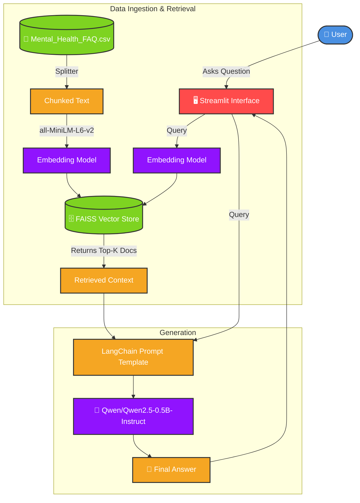

# 🧠 GenAI Mental Health RAG Chatbot


A domain-specific, privacy-first chatbot designed to answer questions about mental health using **Retrieval-Augmented Generation (RAG)**.  
This project retrieves relevant information from a curated Mental Health FAQ dataset and generates compassionate, human-like responses using a completely local, open-source Large Language Model (LLM).

---

## ✨ Key Features

- **Domain-Specific Knowledge**  
  Answers are grounded in a dedicated `Mental_Health_FAQ.csv` dataset, reducing hallucinations.

- **100% Local Inference**  
  Uses open-source models downloaded to your machine, ensuring data privacy with no API keys required.

- **Interactive UI**  
  Built with Streamlit for a clean, chat-like experience.

- **Hyperparameter Experimentation**  
  A sidebar allows users to dynamically adjust RAG parameters:
  - Number of retrieved documents (`k`)
  - Text chunk size
  - LLM temperature (creativity/randomness)

- **Source Transparency**  
  View the exact document chunks retrieved by the vector store to formulate the answer.

---

## 🏗️ Architecture Diagram

The following diagram illustrates the RAG pipeline used in this application:



---

## 🛠️ Technology Stack

| Component     | Technology                                                 |
| ------------- | ---------------------------------------------------------- |
| Framework     | Streamlit                                                  |
| Orchestration | LangChain                                                  |
| Local LLM     | Qwen/Qwen2.5-0.5B-Instruct via HuggingFace Pipeline        |
| Embeddings    | all-MiniLM-L6-v2 via HuggingFace (`sentence-transformers`) |
| Vector Store  | FAISS (CPU-optimized)                                      |
| Dataset       | CSV format containing standard Mental Health FAQs          |

---

## 🚀 Getting Started

### Prerequisites

Make sure you have Python 3.9 or higher installed on your system.

### Windows Quick Start

For Windows users, a convenient batch script is provided. Simply double-click `run.bat` or run it from the command line:

```bat
run.bat
```

This script will automatically install all requirements and launch the Streamlit app.

### Manual Installation (Mac/Linux/Windows)

Clone the repository or navigate to the project folder:

```bash
cd GenAI_Mental_Health_RAG
```

Create a virtual environment (recommended):

```bash
python -m venv venv
```

Activate the virtual environment:

```bash
source venv/bin/activate
```

On Windows, use:

```powershell
venv\Scripts\activate
```

Install dependencies:

```bash
pip install -r requirements.txt
```

Run the application:

```bash
streamlit run app.py
```

> **Note on First Run:** The very first time you run the app, it will download the embedding model and the LLM (`Qwen2.5-0.5B`) from HuggingFace. This may take several minutes and require a few gigabytes of disk space depending on your internet connection.

---

## 🕹️ How to Use

1. Open the local URL provided by Streamlit in your browser (usually `http://localhost:8501`).
2. Experiment with the sidebar:
   - Tweak the number of retrieved documents to give the LLM more or less context.
   - Adjust the chunk size to see how indexing granularity affects answers.
   - Change the temperature to make the bot more factual (`0.1`) or more conversational/creative (`0.7+`).
3. Type a question in the chat box, for example:
   - “What are the warning signs of mental illness?”
   - “How can I find a therapist?”
4. Expand the **Show Retrieved Sources** dropdown under the assistant’s reply to see exactly which parts of the dataset were used to generate the answer.

---

## 📝 Dataset Acknowledgment

The included dataset (`Mental_Health_FAQ.csv`) contains general frequently asked questions regarding mental health, symptoms, and treatment avenues.

---

## ⚠️ Disclaimer

This chatbot is an educational AI project and is **not** a substitute for professional medical advice, diagnosis, or treatment.
